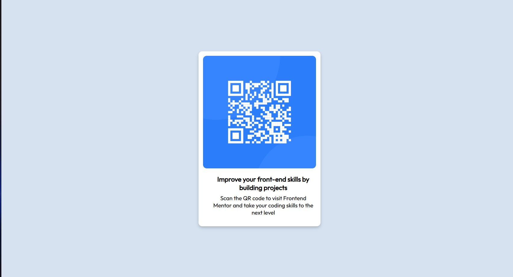

# Frontend Mentor - QR code component solution

This is a solution to the [QR code component challenge on Frontend Mentor](https://www.frontendmentor.io/challenges/qr-code-component-iux_sIO_H). Frontend Mentor challenges help you improve your coding skills by building realistic projects. 

## Table of contents

- [Overview](#overview)
  - [Screenshot](#screenshot)
  - [Links](#links)
- [My process](#my-process)
  - [Built with](#built-with)
  - [What I learned](#what-i-learned)
  - [Continued development](#continued-development)
  - [Useful resources](#useful-resources)
- [Author](#author)
- [Acknowledgments](#acknowledgments)

## Overview
This project based on understanding, learning and mastering of HTML and CSS

### Screenshot



### Links

- Solution URL: (https://github.com/Paul-Cavain/Simple_QR_Code)
- Live Site URL: (https://simple-qr-code-wheat.vercel.app)

## My process

### Built with

- Semantic HTML5 markup
- CSS custom properties
- Flexbox
- Mobile-first workflow

### What I learned

Learning about link icons in webpages title in html

```html
<link rel="icon" type="image/png" sizes="32x32" href="./images/favicon-32x32.png">
```

Learnig about flexbox in css.

```css
.qr_code_contents {
  display: flex;
  flex-direction: column;
  justify-content: center;
  font-size: 15px;
  font-weight: 700;
  padding-left: 20px;
}
```

## Author

- Website - [paul-cavain](https://nkelegome.vercel.app/)
- Frontend Mentor - [@Paul-Cavain](https://www.frontendmentor.io/profile/Paul-Cavain)
- Twitter - [@CavainT](https://x.com/CavainT)

